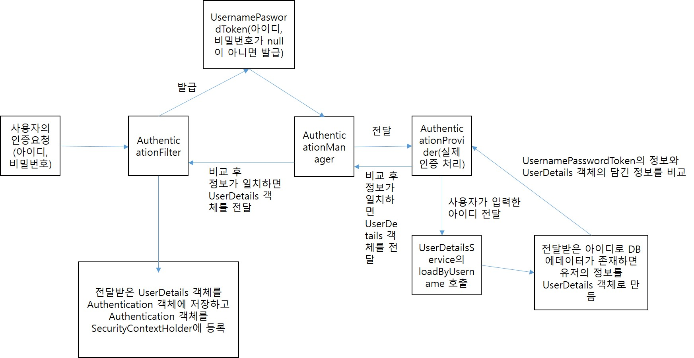

# 1. Spring Security
## 1. Spring Security란?
1. 스프링 시큐리티는 스프링 기반 어플리케이션의 보안(인증(로그인))과 권한(사용자의 권한에 대한 처리), 인가(권한에 따른 사용분리) 등)을 담당하는 스프링 하위 프레임워크.
2. 서블릿 필터와 필터체인을 등록해서 인증, 권한, 인가에 대한 위임모델을 구성. 3.버전까지는 필터체인을 체이닝기법으로 구성했지만 3.1.0버전부터는 필터체인을 람다식을 이용한 함수형으로 구현한다. HttpSecurity 객체를 이용하여 구성하게 된다.
3. 보안과 관련된 체계적인 옵션들을 제공해주기 때문에 개발자가 직접 보안관련 로직을 작성하지 않아도 되는 장점이 있다.
## 2. Spring Security의 용어
1. 접근주체(Principal): 보호된 리소스(어플리케이션)에 접근하는 대상
2. 인증(Authentication): 보호된 리소스(어플리케이션)에 접근하는 대상(Principal)안에 이 대상이 누구인지, 어떤 권한을 가지고 있는 지 확인하는 과정(로그인)
3. 인증토큰(Authentication Token): 인증(로그인)과정을 통해 발급되는 토큰. 토큰안에는 username(사용자ID), password(사용자 비밀번호), 권한이 세팅된다.
4. 인가(Authorize): 해당 리소스에 접근하는 대상이 허용된 권한을 가지고 있는 지 확인하는 과정.
5. 권한: 특정 리소스에 대한 접근 제한. 스프링 시큐리티 사용 시 모든 리소스에는 접근 제한이 걸려있다. 인가 과정을 통해 해당 리소스에 대한 접근 권한을 가지고 있는 지 감사하고 권한이 있으면 리소스를 사용할 수 있게 권한이 없으면 리소스에 접근을 못하도록 설정.
## 3. Spring Security 로그인 인증 과정(form기반 로그인)
1. 사용자가 화면에서 username(사용자ID)와 password(사용자 비밀번호)를 입력하고 인증요청을 보낸다.
2. AuthenticationFilter(구현체인 UserNamePasswordAuthenticationFilter)가 사용자가 보낸 인증요청을 인터셉트한다(가로챈다). 사용자가 입력한 아이디와 비밀번호에 대한 유효성검사를 진행(입력한 값이 null인지 아닌지를 검사).
3. 유효성 검사가 끝나면(null이 입력되지 않았을 때) 사용자가 입력한 아이디와 비밀번호로 인증용 객체인 UsernamePasswordAuthenticationToken을 만들어서 AuthenticationManager(구현체인 ProviderManager)로 전달한다.
4. AuthenticationManager에서는 실제 인증을 해줄 AuthenticationProvider로 인증용 객체인 UsernamePasswordAuthenticationToken을 전달.
5. AuthenticationProvider에서 전달받은 인증용 객체로 실제 인증 과정을 처리한다.
    - 실제 인증 처리과정1: DB에서 사용자 정보를 가져올 UserDetailsService 객체에 아이디를 넘겨주고 loadByUsername이라는 메소드를 통해서 해당 아이디의 사용자가 존재하는 지 검사. 사용자가 존재하면 인증에서 사용할 사용자 정보(아이디, 비밀번호, 권한 등)를 UserDetails 객체에 담아서 AuthenticationProvider로 객체를 리턴.
    - 실제 인증 처리과정2: AuthenticationProvider에서는 전달받은 UserDetails 객체의 정보와 UsernamePasswordAuthenticationToken의 정보를 비교한다. 인증(DB의 아이디, 비밀번호와 사용자가 입력한 아이디, 비밀번호가 같으면)이 완료되면 사용자 정보를 가지고 있는 UserDetails객체를 Authentication 객체에 등록하고 Authentication 객체 자체를 SecurityContextHolder에 등록한다.
    - 

## 4. OAuth 라이브러리
1. OAuth: Open Authorize의 약자로 사용자들의 비밀번호는 제공하지 않고 다른 웹 사이트나 어플리케이션에 존재하는 자신의 정보에 대한 접근 권한을 부여할 수 있는 개방형 접근 위임 라이브러리
2. 카카오 로그인 시 제공정보를 선택 후 동의 버튼을 누르면 그 사이트에서 카카오에 저장되어 있는 내 정보에 대한 접근 권한을 받아서 사용.
3. OAuth 용어
    - 자원 소유자(Resource Owner): 정보를 소유하고 있는 주체. 사용자를 뜻함
    - 자원 서버(Resource Server): 자원 소유자에 대한 정보를 저장하고 있는 서버나 어플리케이션(카카오, 네이버, 구글, 페이스북 등)
    - 인가 서버(Authorization Server): 자원 소유자에 대한 인증을 진행하는 인증 서버. 다른 웹 사이트나 어플리케이션에서 자원 서버에 저장되어 있는 사용자 정보에 접근할 수 있는 권한을 부여하기 위한 Access Token을 발행해주는 서버
    - 클라이언트(Client): 현재 자원 소유자가 사용하고 있는 웹 사이트나 어플리케이션. 자원 소유자의 동의를 통해 자원 서버에 있는 자원 소유자의 정보를 가져와 사용할 웹 사이트나 어플리케이션
4. 간편 로그인 진행순서
    - 자원 소유자(사용자) 간편 로그인 -> 클라이언트(현재 사용중인 사이트)에서 자원 서버로 요청 -> 인가 서버에서 사용자에 대한 인증 및 동의 절차가 진행 완료되면 Access Token 발행 -> Access Token을 통해 자원 서버에 있는 사용자 정보를 취득 -> 현재 사용중인 웹 사이트에서 취득한 사용자 정보를 사용