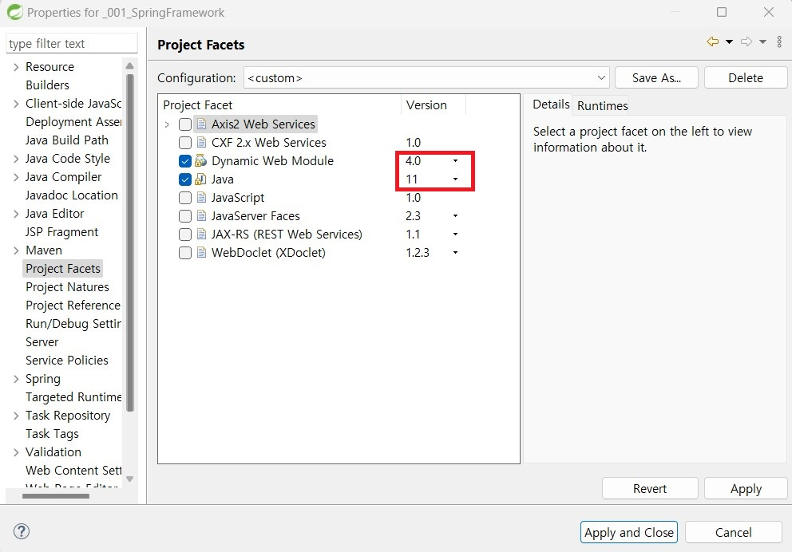
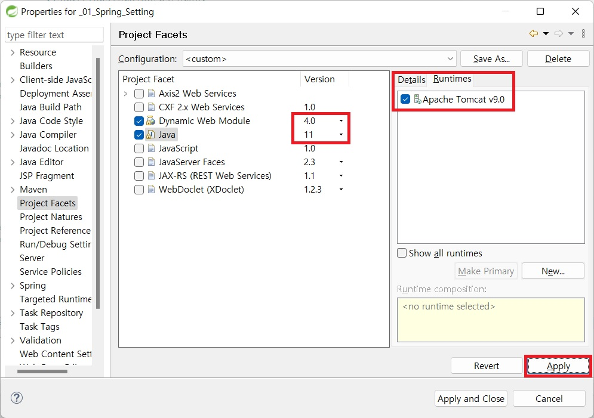

# 1. Spring Framework 프로젝트 생성 및 설정
- 서버 다운
    - 구글에서 tomcat 9 download 검색 > https://tomcat.apache.org/download-90.cgi 접속 후 > OS에 맞는 버전 다운로드 > 압축해제
- sts에 서버 추가
    - Servers 우클릭 > New > Server 선택
    -  
    - server type에 Apache 폴더 > Tomcat 9.0 server 선택 후 Next 클릭
    - 
    - Browse 클릭 후 압축해제한 tomcat 디렉토리 선택 후 Finish 클릭
    - 
- 프로젝트 생성
    - File > New > Spring Legacy Project 선택 또는 Alt + Shift + n > Spring Legacy Project 선택
    - 
    - Project Name 설정 후 Spring MVC Project 선택 후 Next 클릭
    - 
    - 기본 패키지 이름 설정 후 Finish 클릭
    - 기본 패키지 이름 설정 방식
        - 도메인(com, net, org, kr, ...).회사명(bit, naver, navercloud, ...).프로젝트명(springboard, bitshop, bitgroupware, ...)
    - 
- 버전 변경
    - pom.xml
        - line 10 properties의 버전들 변경
        ```
        <properties>
            <java-version>1.11</java-version>
            <org.springframework-version>5.2.24.RELEASE</org.springframework-version>
            <org.aspectj-version>1.9.19</org.aspectj-version>
            <org.slf4j-version>2.0.7</org.slf4j-version>
        </properties>
        ```
        - line 61~84 log4j 삭제
        - 삭제한 부분에 추가
        ```
        <!-- log4j -->
        <dependency>
            <groupId>org.apache.logging.log4j</groupId>
            <artifactId>log4j-api</artifactId>
            <version>2.20.0</version>
        </dependency>
        <dependency>
            <groupId>org.apache.logging.log4j</groupId>
            <artifactId>log4j-core</artifactId>
            <version>2.20.0</version>
        </dependency>
        <dependency>
            <groupId>org.apache.logging.log4j</groupId>
            <artifactId>log4j-jcl</artifactId>
            <version>2.20.0</version>
        </dependency>
        <dependency>
            <groupId>org.apache.logging.log4j</groupId>
            <artifactId>log4j-slf4j2-impl</artifactId>
            <version>2.20.0</version>
            <scope>test</scope>
        </dependency>
        ``` 
        - line 92 부터 서블릿 관련 버전 변경
        ```
        <!-- Servlet -->
        <dependency>
            <groupId>javax.servlet</groupId>
            <artifactId>javax.servlet-api</artifactId>
            <version>4.0.1</version>
            <scope>provided</scope>
        </dependency>
        <dependency>
            <groupId>javax.servlet.jsp</groupId>
            <artifactId>javax.servlet.jsp-api</artifactId>
            <version>2.3.3</version>
            <scope>provided</scope>
        </dependency>
        <dependency>
        <groupId>javax.servlet</groupId>
            <artifactId>jstl</artifactId>
            <version>1.2</version>
        </dependency>
        ```
        - junit 버전 수정
        ```
        <!-- Test -->
        <dependency>
            <groupId>junit</groupId>
            <artifactId>junit</artifactId>
            <version>4.13.2</version>
            <scope>test</scope>
        </dependency>
        ```
        - maven 플러그인 버전 & 자바 버전 수정
        ```
        <plugin>
            <groupId>org.apache.maven.plugins</groupId>
            <artifactId>maven-compiler-plugin</artifactId>
            <version>3.11.0</version>
            <configuration>
                <source>1.11</source>
                <target>1.11</target>
                <compilerArgument>-Xlint:all</compilerArgument>
                <showWarnings>true</showWarnings>
                <showDeprecation>true</showDeprecation>
            </configuration>
        </plugin>
        <plugin>
            <groupId>org.codehaus.mojo</groupId>
            <artifactId>exec-maven-plugin</artifactId>
            <version>3.1.0</version>
            <configuration>
                <mainClass>org.test.int1.Main</mainClass>
            </configuration>
        </plugin>
        ```
    - Project Facets 수정
        - 프로젝트 마우스 우클릭 properties -> Project Facets으로 이동
        - dynamic web module 4.0으로 수정
        - java version 11로 수정
        - 
        - Rumtimes 탭으로 이동 후 Apache Tomcat v9.0 체크 후 Apply 클릭
        - 
    - web.xml 수정
        - src > main > webapp > WEB-INF > web.xml
        - web-app의 version 4.0 그리고 xsi:schemalocation의 .xsd 앞에 _4_0으로 수정
        ```
        <web-app version="4.0" xmlns="http://java.sun.com/xml/ns/javaee" xmlns:xsi="http://www.w3.org/2001/XMLSchema-instance" xsi:schemaLocation="http://java.sun.com/xml/ns/javaee https://java.sun.com/xml/ns/javaee/web-app_4_0.xsd">
        ```
    - org.eclipse.wst.common.project.facet.core.xml 파일 수정
        - 프로젝트 경로/.settings 폴더의 org.eclipse.wst.common.project.facet.core.xml 파일을 visual studio code 파일 수정
        - jst.web의 버전 4.0으로 수정
        - jst.java의 버전 1.11로 수정
        - 
        ```
        <faceted-project>
            <fixed facet="jst.web"/>
            <fixed facet="jst.java"/>
            <installed facet="jst.web" version="4.0"/>
            <installed facet="jst.java" version="1.11"/>
        </faceted-project>
        ```
    - sts 리스타트
- UTF-8 설정
    - Window > preferences
    - General > Workspace > Text file encoding > Other(UTF-8)로 설정
    - General > Content Types > Java Class File > Default encoding을 UTF-8로 설정후 Update 클릭
    - General > Conten Types > Text > JSP > Default encoding을 UTF-8로 설정후 Update 클릭
    - Web > CSS Files, HTML Files, JSP Files의 Encoding을 UTF-8로 설정
    - Apply and Close 버튼 클릭
- <b style="color: red">예제 프로젝트: _001_SpringFramework_Setting</b>